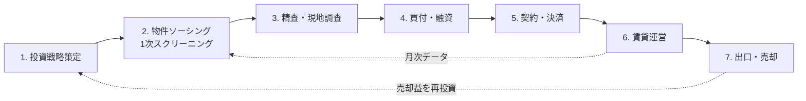
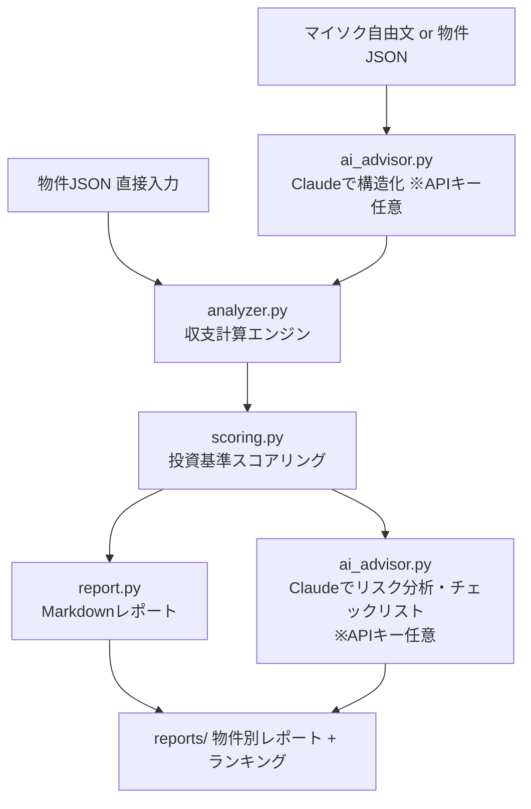

# 不動産投資事業ワークフロー設計書

副業として不動産賃貸業を立ち上げ・運営するための業務フローを、**AIに任せる作業**と**人がやるべき作業**に分解した設計書。
本リポジトリの `real-estate/system/` に、このうち「フェーズ2: 物件ソーシング〜1次スクリーニング」を自動化するAIシステムを実装している。

> 参考動画（YouTube 9本）は本環境からアクセスできなかったため、一般的な不動産投資事業（区分・一棟・戸建て再生）の標準プロセスをベースに設計している。動画特有のノウハウ（特定の融資手法・特定エリア戦略など）があれば、後からこのワークフローの該当フェーズに差し込めば良い。

---

## 全体像



**基本方針: 「情報処理・計算・下書き」はAI、「現地の五感・交渉・最終判断・責任」は人間。**

---

## フェーズ別 AI / 人間 分担表

### フェーズ1: 投資戦略策定（最初に1回＋年1回見直し）

| 作業 | 担当 | 内容 |
|---|---|---|
| 投資目的・目標CF・リスク許容度の決定 | **人間** | 何のために・いくら・いつまでに。ここが全ての判断基準になる |
| 自己資金・与信の棚卸し | **人間** | 年収・勤続・既存借入。銀行に出す情報の整理はAIが補助 |
| 投資基準（利回り・DSCR・CF等の閾値）の設定 | 人間 + AI | AIが基準値ごとの試算を出し、人間が閾値を決める → `system/scoring.py` の設定値になる |
| エリア・物件タイプの選定 | 人間 + AI | AIが人口動態・賃貸需要データを整理、人間が土地勘・出張可否で決定 |

### フェーズ2: 物件ソーシング〜1次スクリーニング ★AIシステム実装済み

| 作業 | 担当 | 内容 |
|---|---|---|
| ポータル・マイソクの物件情報を構造化 | **AI** | `ai_advisor.py` — マイソクの自由文をClaudeでJSON化（価格・賃料・構造・築年…） |
| 収支シミュレーション | **AI** | `analyzer.py` — 表面/実質利回り・元利均等返済・月次CF・DSCR・CCR・返済比率・損益分岐入居率・減価償却・10年保有IRR |
| スコアリング＆判定 | **AI** | `scoring.py` — 投資基準に照らして A(買付検討)/B(現地調査)/C(指値次第)/D(見送り) を理由付きで判定 |
| 指値（目標利回りに届く価格）の逆算 | **AI** | 判定Cの物件に「いくらなら買えるか」を自動計算 |
| レポート・ランキング生成 | **AI** | `report.py` — 物件別Markdownレポート＋横断ランキング |
| リスク・確認事項の洗い出し | **AI** | Claudeが物件ごとの懸念点と現地調査チェックリストを生成 |
| 仲介業者との関係構築・未公開情報の入手 | **人間** | 人間関係でしか出ない情報。AIは問い合わせメール下書きまで |
| 「なんか嫌な感じ」の直感 | **人間** | 数字に出ない違和感は人間の担当 |

**運用イメージ**: 毎朝ポータルの新着をチェック → 気になる物件のマイソク文面を貼り付け → システムが判定 → A/B判定だけ人間が見る。**1物件あたりの検討時間を30分→2分に短縮**するのが狙い。

### フェーズ3: 精査・現地調査

| 作業 | 担当 | 内容 |
|---|---|---|
| 現地調査チェックリスト生成 | **AI** | 物件タイプ・築年・判定理由に応じたリスト（システムのレポートに同梱） |
| 賃料相場・空室率の下調べ | **AI** | 周辺の募集事例整理、想定賃料の妥当性チェック |
| 現地確認（建物・共用部・周辺環境・嫌悪施設） | **人間** | 写真を撮ってAIに見せれば劣化診断の補助は可能 |
| 管理会社・レントロールの真偽確認 | **人間** | ヒアリングは人間、聞くべき質問リストはAI |
| 重要事項調査報告書・謄本の読み込み | AI + 人間 | AIが要点抽出・矛盾検出、最終確認は人間 |

### フェーズ4: 買付・融資

| 作業 | 担当 | 内容 |
|---|---|---|
| 買付証明のドラフト | **AI** | 指値根拠（システムの逆算値）を添えて作成 |
| 価格交渉 | **人間** | 交渉戦略の壁打ち相手にAIを使う |
| 銀行向け資料（事業計画書・収支計画）作成 | **AI** | `analyzer.py` の出力をそのまま事業計画の数値根拠に流用 |
| 融資条件の比較シミュレーション | **AI** | 金利・期間・LTVの組み合わせ別にCF/DSCRを再計算 |
| 銀行開拓・面談 | **人間** | 属性説明・熱意は人間にしかできない |

### フェーズ5: 契約・決済

| 作業 | 担当 | 内容 |
|---|---|---|
| 売買契約書・重説のレビュー補助 | **AI** | 論点・特約の抽出、一般的でない条項のフラグ |
| 契約・決済への出席、最終確認 | **人間** | 法的責任を伴う行為はすべて人間 |
| 火災保険の見積比較 | **AI** | 条件整理と比較表作成 |

### フェーズ6: 賃貸運営

| 作業 | 担当 | 内容 |
|---|---|---|
| 募集条件・募集図面のドラフト | **AI** | 家賃査定＋物件アピール文生成 |
| 月次収支モニタリング | **AI** | 実績CFと計画の乖離検知 → 閾値超えたらアラート |
| 修繕見積の比較・相場チェック | **AI** | 相見積の整理、ぼったくり検知 |
| 確定申告の下準備 | **AI** | 経費仕訳の整理、減価償却計算（本システムの償却計算を流用可） |
| 管理会社の選定・入居者トラブルの最終判断 | **人間** | 委託先とトラブル対応の責任判断 |
| リフォーム内容・大規模修繕の意思決定 | **人間** | AIは投資対効果の試算まで |

### フェーズ7: 出口・売却

| 作業 | 担当 | 内容 |
|---|---|---|
| 売却シミュレーション（残債 vs 想定売価・税引後手残り） | **AI** | `analyzer.py` の保有期間シミュレーションを流用 |
| 売り時の定点観測 | **AI** | 「残債が想定売価を下回った」「償却切れが近い」等のシグナル検知 |
| 売却判断・媒介契約・交渉 | **人間** | 最終判断と交渉 |

---

## AIシステム（実装済み）のアーキテクチャ



- **決定論的な計算（利回り・返済・IRR等）はコードで行い、LLMには計算させない**。LLMの担当は「非構造データの構造化」と「定性的なリスク分析・文章生成」のみ。
- `ANTHROPIC_API_KEY` が未設定でも計算・判定・レポートは全て動く（AI補助部分だけスキップ）。

### 使い方

```bash
cd real-estate/system

# 1) 物件JSONを properties/ に置いて一括分析
python3 main.py analyze

# 2) 単一ファイルの分析
python3 main.py analyze properties/sample_01_kubun_rc.json

# 3) マイソクの文面から物件JSONを生成（要 ANTHROPIC_API_KEY）
python3 main.py intake maisoku.txt -o properties/new.json

# 4) 融資条件の感度分析
python3 main.py loan-matrix properties/sample_02_apartment.json
```

### 投資基準のカスタマイズ

`system/criteria.json` を編集する。初期値は保守的な副業投資家想定（税引前CF黒字・DSCR1.2以上など）。フェーズ1で自分の基準を決めたらここに反映する。

---

## 次のステップ（未実装・拡張候補）

1. **ポータル自動巡回**: 楽待・健美家等の新着をスクレイピング→自動判定→A/B判定のみ通知（各サイトの利用規約確認が前提）
2. **写真からの劣化診断**: 現地写真をClaudeのvisionで解析し修繕費概算
3. **月次運営モニタリング**: 家賃入金CSVを食わせて計画比の乖離アラート
4. **銀行提出用事業計画書の自動生成**: analyzer出力→docxテンプレ流し込み
